# Agent ↔ Server Protocol Contract (V1)

## 1. Purpose & status

This document is the V1 wire contract derived from the agent-mode design spec at `docs/superpowers/specs/2026-05-16-agent-mode-design.md` ("spec A"). It is normative for any implementation of either side of the agent ↔ server channel. Any change to wire framing, methods, error codes, capability fields, or state-machine transitions in this contract MUST update spec A first; this contract is then re-derived. The contract is pinned by epic A (agent-mode runtime — `syslog-mcp-qgnx`) and epic D (probe registry — `syslog-mcp-fue9`), which both consume these method names and error codes for the RPC bridge that carries probe traffic.

## 2. Wire framing

- **Transport.** RFC 6455 WebSocket. Production deployments use `wss://syslog.tootie.tv/ws/agent` terminated by SWAG; loopback `ws://` is allowed only when `agent.allow_insecure = true`.
- **Subprotocol.** Client offers `Sec-WebSocket-Protocol: syslog-mcp.v1`. Server confirms the same. Mismatched subprotocol → HTTP `400` and the upgrade is refused.
- **Encoding.** WebSocket **text** frames. Payload is UTF-8 JSON. Binary frames are reserved for a future compressed log-batch transport and MUST be rejected with close code `1003` in V1.
- **Compression.** No frame-level or payload-level compression in V1 (no `permessage-deflate`, no zstd application-layer compression). Agents may advertise `compression: ["zstd"]` in `capabilities` but the V1 server ignores the hint.
- **Framing rule.** Exactly **one JSON-RPC 2.0 message per WebSocket frame**. Top-level JSON arrays (JSON-RPC array batching) are rejected with `-32600 Invalid Request`. Batching is performed inside `logs.push.params.entries[]`.
- **Frame size limit.** Maximum frame size is **1 MiB (1,048,576 bytes)**. Oversized frames close the connection with WS close code `1009 Message Too Big` and the server records `last_disconnect_reason = "1009 oversize"`. A pre-handshake byte cap of **1 KiB** applies as a connection-level byte counter before the `agent.hello` JSON frame is fully buffered — this limits unauthenticated bytes on the wire, not the serialized size of the `agent.hello` JSON payload itself (which may be larger once the `supported_probes` array is populated).
- **Liveness.** WebSocket-level ping every 20 s, server-initiated. Three consecutive missed pongs → close `1011`.

## 3. Auth handshake

Byte-level flow for a fresh connection:

1. Client opens a WebSocket connection to `/ws/agent` with subprotocol `syslog-mcp.v1`. There is no HTTP-layer auth beyond what SWAG enforces (TLS termination only).
2. WebSocket upgrade completes. The server records the remote address, opens a connection task, and **starts a 5-second handshake timer**. While the timer is active no row in `agents` is mutated.
3. Client sends `agent.hello` as the **first** JSON-RPC frame on the connection. The payload includes `token`, `host_id`, `hostname`, `agent_version`, `protocol_version`, `platform`, and `capabilities` (see §4.1).
4. Server validates:
   - JSON-RPC envelope shape (`-32600` on failure).
   - `protocol_version == 1` (otherwise `-32003`).
   - `agent_version >= min_agent_version` from server config (`-32003`).
   - Token: BLAKE3-hashes the supplied `token`, compares against `agents.token_hash` and `agents.token_hash_prev` for the supplied `host_id`. No match → `-32001`. Match against a row with `connection_state = 'Revoked'` or NULL hashes → `-32002`.
5. On success, server responds with `HelloResult` (see §4) and the connection transitions to **Active**. `agents.connection_state` is set to `Active`, `last_handshake = now`, `session_id` is set to a new UUID. **Token rotation**: when the inbound `token` was a one-time enrollment token (`agents.token_hash` matched a row whose `connection_state = NeverConnected`), the server generates a new long-lived token, sets `agents.token_hash = BLAKE3(new_token)`, clears `agents.token_hash_prev` (no grace window on first enroll), flips `connection_state` to `Active`, and ships `new_token` back in `HelloResult.rotated_token`. The agent MUST atomically persist `rotated_token` to its token file before sending any further RPCs — losing the rotated token mid-handshake means the agent cannot reconnect. For subsequent reconnects with an already-long-lived token, `rotated_token` is absent (or null) and the existing `agents.token_hash` is retained.
6. On any auth failure, server sends a JSON-RPC error response with the appropriate `-32000..-32003` code and closes the WebSocket with code `4001` (auth failed) or `4002` (revoked). On handshake timeout the server sends no message and closes with `4000` (handshake timeout).
7. The agent on receiving a fatal auth error transitions to `FatalAuth`. On `-32002 TokenRevoked` it deletes `/etc/syslog-agent/token` and stops reconnecting permanently. On other fatal codes it logs and alerts but stops retrying.

The unauthenticated socket window is bounded by the 5 s handshake timer **and** the 1 KiB pre-hello byte counter. Tokens are never logged: `Display`/`Debug` impls on `HelloParams` redact `token`.

## 4. Method catalog

Shared `$defs` are inlined into each method schema for self-containment. Where `$defs` are referenced by more than one method, the canonical definition is given under `agent.hello` / `logs.push` and reused by reference in prose.

### 4.1 `agent.hello`

- **Direction:** client → server
- **Kind:** request (response required)
- **Purpose:** handshake, identity, capability declaration, replay coordination
- **Errors:** `-32001 AuthFailed`, `-32002 TokenRevoked`, `-32003 AgentVersionUnsupported`, `-32600 InvalidRequest`, `-32602 InvalidParams`

`params` schema:

```json
{
  "$schema": "https://json-schema.org/draft/2020-12/schema",
  "type": "object",
  "required": [
    "protocol_version",
    "agent_version",
    "hostname",
    "host_id",
    "platform",
    "capabilities",
    "token"
  ],
  "additionalProperties": false,
  "properties": {
    "protocol_version": { "type": "integer", "minimum": 1, "maximum": 1 },
    "agent_version":    { "type": "string", "pattern": "^\\d+\\.\\d+\\.\\d+(?:[-+].*)?$" },
    "hostname":         { "type": "string", "minLength": 1, "maxLength": 253 },
    "host_id":          { "type": "string", "format": "uuid" },
    "platform": {
      "type": "object",
      "required": ["os", "arch", "kernel"],
      "additionalProperties": false,
      "properties": {
        "os":     { "type": "string" },
        "arch":   { "type": "string" },
        "kernel": { "type": "string" },
        "distro": { "type": ["string", "null"] }
      }
    },
    "capabilities": {
      "type": "object",
      "required": ["supported_probes", "sources", "max_batch_entries", "compression"],
      "additionalProperties": false,
      "properties": {
        "supported_probes":  { "type": "array", "items": { "type": "string" } },
        "sources":           { "type": "array", "items": { "type": "string", "enum": ["journald","file","docker","custom"] } },
        "max_batch_entries": { "type": "integer", "minimum": 1, "maximum": 65535 },
        "compression":       { "type": "array", "items": { "type": "string", "enum": ["zstd"] } }
      }
    },
    "token":           { "type": "string", "minLength": 32, "maxLength": 256 },
    "resume_from_seq": { "type": ["integer", "null"], "minimum": 0 }
  }
}
```

`result` schema:

```json
{
  "$schema": "https://json-schema.org/draft/2020-12/schema",
  "type": "object",
  "required": ["server_version", "server_time", "accepted_seq", "config", "session_id"],
  "additionalProperties": false,
  "properties": {
    "server_version": { "type": "string" },
    "server_time":    { "type": "string", "format": "date-time" },
    "accepted_seq":   { "type": "integer", "minimum": 0 },
    "session_id":     { "type": "string", "format": "uuid" },
    "rotated_token":  {
      "description": "Set when the server has rotated the agent's token (typically: first enroll, where the agent sent a one-time enrollment token and the server replaces it with a long-lived token). When present, the agent MUST atomically persist this as its new long-lived credential, overwriting whatever it sent in agent.hello.params.token. Server-side, agents.token_hash is updated to BLAKE3(rotated_token); the previous one-time token becomes invalid immediately (no grace window for first-enroll rotation). Absent when the server determined no rotation was needed.",
      "type": ["string", "null"],
      "minLength": 32,
      "maxLength": 256
    },
    "config": { "$ref": "#/$defs/AgentConfig" }
  },
  "$defs": {
    "AgentConfig": {
      "type": "object",
      "required": [
        "heartbeat_interval_secs",
        "max_batch_entries",
        "flush_interval_ms",
        "log_sources",
        "probe_concurrency"
      ],
      "additionalProperties": false,
      "properties": {
        "heartbeat_interval_secs": { "type": "integer", "minimum": 5,  "maximum": 600 },
        "max_batch_entries":       { "type": "integer", "minimum": 1,  "maximum": 65535 },
        "flush_interval_ms":       { "type": "integer", "minimum": 10, "maximum": 60000 },
        "metrics_interval_secs":   { "type": ["integer", "null"], "minimum": 1 },
        "probe_concurrency":       { "type": "integer", "minimum": 1,  "maximum": 64 },
        "log_sources": {
          "type": "array",
          "items": {
            "type": "object",
            "required": ["kind"],
            "properties": {
              "kind":   { "type": "string", "enum": ["journald","file","docker","custom"] },
              "path":   { "type": "string" },
              "filter": { "type": ["string","null"] },
              "labels": { "type": "object", "additionalProperties": { "type": "string" } }
            }
          }
        }
      }
    }
  }
}
```

Example request:

```json
{
  "jsonrpc": "2.0",
  "id": 1,
  "method": "agent.hello",
  "params": {
    "protocol_version": 1,
    "agent_version": "0.1.0",
    "hostname": "dookie.lan",
    "host_id": "2b9a0b3a-7e3c-4d2a-9c0e-9bbf5d3a1f01",
    "platform": { "os": "linux", "arch": "x86_64", "kernel": "6.6.21", "distro": "Ubuntu 24.04" },
    "capabilities": {
      "supported_probes": ["exec.systemctl_status", "fs.disk_usage"],
      "sources": ["journald","docker"],
      "max_batch_entries": 1000,
      "compression": ["zstd"]
    },
    "token": "c2VjcmV0LXRva2VuLW9wYXF1ZS1iYXNlNjR1cmwtMzJieXRlcw",
    "resume_from_seq": 42117
  }
}
```

Example success response:

```json
{
  "jsonrpc": "2.0",
  "id": 1,
  "result": {
    "server_version": "0.20.0",
    "server_time": "2026-05-16T19:42:11.501Z",
    "accepted_seq": 42117,
    "session_id": "f3b6c4f7-7a3e-4f7f-9d4d-2f6f0d6fa9a1",
    "config": {
      "heartbeat_interval_secs": 30,
      "max_batch_entries": 1000,
      "flush_interval_ms": 200,
      "metrics_interval_secs": 60,
      "probe_concurrency": 4,
      "log_sources": [
        { "kind": "journald", "filter": "_TRANSPORT=journal" },
        { "kind": "docker" }
      ]
    }
  }
}
```

Example failure response:

```json
{
  "jsonrpc": "2.0",
  "id": 1,
  "error": {
    "code": -32001,
    "message": "AuthFailed",
    "data": { "reason": "token_hash_mismatch" }
  }
}
```

### 4.2 `agent.heartbeat`

- **Direction:** client → server
- **Kind:** notification (no `id`, no response)
- **Purpose:** application-level liveness; updates `agents.last_seen` and exposes buffer/push pressure
- **Errors:** none (notifications cannot produce a JSON-RPC error response). Malformed payloads are logged server-side and the frame is dropped; no error is returned.

`params` schema:

```json
{
  "$schema": "https://json-schema.org/draft/2020-12/schema",
  "type": "object",
  "required": ["ts", "queue_depth", "buffer_bytes"],
  "additionalProperties": false,
  "properties": {
    "ts":           { "type": "string", "format": "date-time" },
    "queue_depth":  { "type": "integer", "minimum": 0 },
    "buffer_bytes": { "type": "integer", "minimum": 0 },
    "push_lag_seq": { "type": "integer", "minimum": 0 }
  }
}
```

Example:

```json
{
  "jsonrpc": "2.0",
  "method": "agent.heartbeat",
  "params": {
    "ts": "2026-05-16T19:42:41.002Z",
    "queue_depth": 17,
    "buffer_bytes": 4096,
    "push_lag_seq": 0
  }
}
```

### 4.3 `agent.shutdown`

- **Direction:** server → client
- **Kind:** notification (per this contract; spec A's prose calls it a request but no semantically meaningful response payload is defined, and the connection closes immediately afterward — the V1 contract pins this as a one-way notification; see §11 decision log)
- **Purpose:** server signals a planned disconnect (reload, revocation, decommission) so the agent can drain its buffer

`params` schema:

```json
{
  "$schema": "https://json-schema.org/draft/2020-12/schema",
  "type": "object",
  "required": ["reason", "drain_seconds"],
  "additionalProperties": false,
  "properties": {
    "reason":        { "type": "string", "enum": ["ServerReload", "Revoked", "Decommission"] },
    "drain_seconds": { "type": "integer", "minimum": 0, "maximum": 300 }
  }
}
```

Example:

```json
{
  "jsonrpc": "2.0",
  "method": "agent.shutdown",
  "params": { "reason": "Revoked", "drain_seconds": 0 }
}
```

On `reason = "Revoked"` the agent deletes its stored token file and transitions to terminal `Revoked` state (no reconnect attempts). On `ServerReload` / `Decommission` the agent best-effort drains its buffer within `drain_seconds`, then closes cleanly.

### 4.4 `logs.push`

- **Direction:** client → server
- **Kind:** request (with ack response). NOTE: spec A's prose models acknowledgment via a separate `logs.ack` notification batched every K=100 or T=200 ms; the V1 wire contract reifies this by making `logs.push` a JSON-RPC **request** whose result carries the up-to-seq acknowledgment. K/T thresholds determine when the server *sends* its result, not whether `logs.push` has an `id`. See §7 and the §11 decision log.
- **Purpose:** ship a contiguous batch of parsed log entries with monotonic `seq` ordering
- **Errors:** `-32004 UnknownHost`, `-32007 BufferOverflow`, `-32008 PayloadTooLarge`, `-32020 Backpressure`, `-32030 QuotaExceeded`, `-32602 InvalidParams`

Shared `$defs` for log/metric/probe types are inlined here and reused throughout this contract:

```json
{
  "$schema": "https://json-schema.org/draft/2020-12/schema",
  "$defs": {
    "Severity": {
      "type": "string",
      "enum": ["emerg","alert","crit","err","warning","notice","info","debug"]
    },
    "LogSource": {
      "oneOf": [
        { "type": "string", "enum": ["journald"] },
        { "type": "string", "pattern": "^file:.+$" },
        { "type": "string", "pattern": "^docker:.+$" },
        { "type": "string", "pattern": "^custom:.+$" }
      ]
    },
    "LogBatchEntry": {
      "type": "object",
      "required": ["seq", "ts", "severity", "message", "source"],
      "additionalProperties": false,
      "properties": {
        "seq":        { "type": "integer", "minimum": 0 },
        "ts":         { "type": "string", "format": "date-time" },
        "severity":   { "$ref": "#/$defs/Severity" },
        "facility":   { "type": ["string","null"] },
        "app_name":   { "type": ["string","null"] },
        "process_id": { "type": ["string","null"] },
        "message":    { "type": "string", "maxLength": 65536 },
        "source":     { "$ref": "#/$defs/LogSource" },
        "metadata":   { "type": ["object","null"] }
      }
    },
    "MetricSample": {
      "type": "object",
      "required": ["name", "value"],
      "additionalProperties": false,
      "properties": {
        "name":   { "type": "string", "minLength": 1, "maxLength": 128 },
        "value":  { "type": "number" },
        "labels": { "type": "object", "additionalProperties": { "type": "string" } }
      }
    },
    "ProbeOutput": {
      "type": "object",
      "required": ["output", "duration_ms"],
      "additionalProperties": false,
      "properties": {
        "output":      {},
        "exit_code":   { "type": ["integer","null"] },
        "stderr":      { "type": ["string","null"] },
        "duration_ms": { "type": "integer", "minimum": 0 }
      }
    }
  }
}
```

`params` schema:

```json
{
  "$schema": "https://json-schema.org/draft/2020-12/schema",
  "type": "object",
  "required": ["seq_start", "entries"],
  "additionalProperties": false,
  "properties": {
    "seq_start": { "type": "integer", "minimum": 0 },
    "entries": {
      "type": "array",
      "minItems": 1,
      "maxItems": 1000,
      "items": { "$ref": "#/$defs/LogBatchEntry" }
    }
  }
}
```

`result` schema (ack):

```json
{
  "$schema": "https://json-schema.org/draft/2020-12/schema",
  "type": "object",
  "required": ["up_to_seq"],
  "additionalProperties": false,
  "properties": {
    "up_to_seq":  { "type": "integer", "minimum": 0 },
    "received_at": { "type": "string", "format": "date-time" }
  }
}
```

Example request:

```json
{
  "jsonrpc": "2.0",
  "id": 12,
  "method": "logs.push",
  "params": {
    "seq_start": 42118,
    "entries": [
      {
        "seq": 42118,
        "ts": "2026-05-16T19:42:50.123Z",
        "severity": "info",
        "app_name": "sshd",
        "process_id": "1431",
        "message": "Accepted publickey for jmagar from 10.0.0.4",
        "source": "journald"
      },
      {
        "seq": 42119,
        "ts": "2026-05-16T19:42:50.501Z",
        "severity": "warning",
        "message": "deprecated option foo",
        "source": "docker:syslog-mcp"
      }
    ]
  }
}
```

Example ack response:

```json
{
  "jsonrpc": "2.0",
  "id": 12,
  "result": { "up_to_seq": 42119, "received_at": "2026-05-16T19:42:50.612Z" }
}
```

Example backpressure error:

```json
{
  "jsonrpc": "2.0",
  "id": 12,
  "error": {
    "code": -32020,
    "message": "Backpressure",
    "data": { "retry_after_ms": 250 }
  }
}
```

### 4.5 `metrics.push`

- **Direction:** client → server
- **Kind:** request (with ack response, same rationale as `logs.push`)
- **Purpose:** ship per-host metric samples. V1 server drops the payloads (table `host_metrics` exists per OQ #4, writer lands in epic D), but accepts the frames so the protocol does not need a bump.
- **Errors:** `-32008 PayloadTooLarge`, `-32020 Backpressure`, `-32602 InvalidParams`

`params` schema:

```json
{
  "$schema": "https://json-schema.org/draft/2020-12/schema",
  "type": "object",
  "required": ["ts", "samples"],
  "additionalProperties": false,
  "properties": {
    "ts": { "type": "string", "format": "date-time" },
    "samples": {
      "type": "array",
      "minItems": 1,
      "maxItems": 512,
      "items": { "$ref": "#/$defs/MetricSample" }
    }
  }
}
```

`result` schema:

```json
{
  "$schema": "https://json-schema.org/draft/2020-12/schema",
  "type": "object",
  "required": ["accepted"],
  "additionalProperties": false,
  "properties": {
    "accepted": { "type": "integer", "minimum": 0 },
    "dropped":  { "type": "integer", "minimum": 0 }
  }
}
```

Example:

```json
{
  "jsonrpc": "2.0",
  "id": 33,
  "method": "metrics.push",
  "params": {
    "ts": "2026-05-16T19:43:00.000Z",
    "samples": [
      { "name": "load1",        "value": 0.42 },
      { "name": "mem_used_pct", "value": 38.1, "labels": { "host": "dookie" } }
    ]
  }
}
```

```json
{ "jsonrpc": "2.0", "id": 33, "result": { "accepted": 2, "dropped": 0 } }
```

### 4.6 `probe.request`

- **Direction:** server → client
- **Kind:** request (response required, correlated by `id`)
- **Purpose:** server-initiated probe invocation against the agent's hardcoded registry (epic D)
- **Errors (in the agent's response):** `-32010 ProbeUnavailable`, `-32011 ProbeExecutionFailed`, `-32012 ProbeTimeout`, `-32602 InvalidParams`

`params` schema:

```json
{
  "$schema": "https://json-schema.org/draft/2020-12/schema",
  "type": "object",
  "required": ["probe", "args", "timeout_ms"],
  "additionalProperties": false,
  "properties": {
    "probe":      { "type": "string", "minLength": 1, "maxLength": 128 },
    "args":       {},
    "timeout_ms": { "type": "integer", "minimum": 1, "maximum": 600000 }
  }
}
```

`result` schema:

```json
{
  "$schema": "https://json-schema.org/draft/2020-12/schema",
  "$ref": "#/$defs/ProbeOutput"
}
```

Example request:

```json
{
  "jsonrpc": "2.0",
  "id": 9001,
  "method": "probe.request",
  "params": {
    "probe": "exec.systemctl_status",
    "args": { "unit": "nginx.service" },
    "timeout_ms": 5000
  }
}
```

Example success response (see §4.7):

```json
{
  "jsonrpc": "2.0",
  "id": 9001,
  "result": {
    "output": { "active": true, "substate": "running" },
    "exit_code": 0,
    "stderr": null,
    "duration_ms": 142
  }
}
```

Example timeout error:

```json
{
  "jsonrpc": "2.0",
  "id": 9001,
  "error": {
    "code": -32012,
    "message": "ProbeTimeout",
    "data": { "probe": "exec.systemctl_status", "timeout_ms": 5000 }
  }
}
```

### 4.7 `probe.response`

- **Direction:** client → server
- **Kind:** **response** to a server-issued `probe.request` (NOT a distinct method).
- **Purpose:** carry the probe result back to the server's `ProbeRouter`. Correlation is exclusively by JSON-RPC `id`.
- **Method name on the wire:** none — this is a JSON-RPC response envelope, not a request. The name `probe.response` exists only as a logical identifier in this contract and in metrics labels.
- **Errors:** any of `-32010`, `-32011`, `-32012`, `-32602` returned as a JSON-RPC error response correlated by `id`.

`result` schema: identical to `probe.request`'s `result` schema (`ProbeOutput`).

See §4.6 for the example.

### 4.8 `config.update`

- **Direction:** server → client
- **Kind:** notification
- **Purpose:** hot-reload `AgentConfig` (probe schedules, log sources, batch sizes, heartbeat cadence)
- **Errors:** none on the wire; the agent diffs and applies. Malformed payload → agent logs locally and ignores.

`params` schema:

```json
{
  "$schema": "https://json-schema.org/draft/2020-12/schema",
  "type": "object",
  "required": ["config"],
  "additionalProperties": false,
  "properties": {
    "apply_after": { "type": ["string","null"], "format": "date-time" },
    "config": { "$ref": "#/$defs/AgentConfig" }
  }
}
```

Example:

```json
{
  "jsonrpc": "2.0",
  "method": "config.update",
  "params": {
    "apply_after": "2026-05-16T20:00:00Z",
    "config": {
      "heartbeat_interval_secs": 45,
      "max_batch_entries": 500,
      "flush_interval_ms": 250,
      "metrics_interval_secs": 30,
      "probe_concurrency": 2,
      "log_sources": [{ "kind": "journald" }]
    }
  }
}
```

## 5. JSON-RPC error codes

The JSON-RPC 2.0 reserved range `-32700..-32600` retains its standard meaning. Application-defined codes occupy `-32000..-32099`.

| Code   | Name                       | Direction      | Meaning                                                                              |
| -----: | -------------------------- | -------------- | ------------------------------------------------------------------------------------ |
| -32700 | ParseError                 | server replies | Malformed JSON in the frame.                                                         |
| -32600 | InvalidRequest             | server replies | Envelope shape wrong (e.g. top-level array, missing `jsonrpc`).                      |
| -32601 | MethodNotFound             | either         | Method name unknown to the receiver.                                                 |
| -32602 | InvalidParams              | either         | `params` failed schema validation.                                                   |
| -32603 | InternalError              | either         | Unhandled exception on the receiver.                                                 |
| -32000 | AuthRequired               | server replies | A non-`agent.hello` frame arrived on an unauthenticated socket.                      |
| -32001 | AuthFailed                 | server replies | Token mismatch against `agents.token_hash` / `token_hash_prev` for the given host.   |
| -32002 | TokenRevoked               | server replies | Both token hashes NULL and `connection_state = 'Revoked'`.                           |
| -32003 | AgentVersionUnsupported    | server replies | `agent_version < min_agent_version` or `protocol_version != 1`.                      |
| -32004 | UnknownHost                | server replies | Supplied `host_id` is not registered in `agents`.                                    |
| -32005 | TokenRotationRequired      | server replies | Token matches `token_hash_prev` only; agent SHOULD re-enroll before grace ends.      |
| -32007 | BufferOverflow             | server replies | Server-side ingest queue is saturated and the batch was dropped.                     |
| -32008 | PayloadTooLarge            | server replies | Frame within 1 MiB but `entries.length` / `samples.length` exceeded the cap.         |
| -32010 | ProbeUnavailable           | agent replies  | Probe not in agent's compiled-in registry / `supported_probes`.                      |
| -32011 | ProbeExecutionFailed       | agent replies  | Probe ran but reported failure; `data.stderr` and `data.exit_code` populated.        |
| -32012 | ProbeTimeout               | agent replies  | Probe exceeded `timeout_ms` budget.                                                  |
| -32020 | Backpressure               | server replies | Agent should slow `logs.push`. `data.retry_after_ms` advises the pause.              |
| -32030 | QuotaExceeded              | server replies | Per-agent leaky-bucket rate limit exhausted.                                         |

WebSocket close codes used by this contract (orthogonal to JSON-RPC error codes):

| WS code | Meaning                              |
| ------- | ------------------------------------ |
| 1000    | Normal closure                       |
| 1003    | Unsupported binary frame             |
| 1009    | Message too big (>1 MiB)             |
| 1011    | Internal error / missed pongs        |
| 4000    | Handshake timeout (no hello in 5s)   |
| 4001    | Auth failed (`-32001`/`-32003`)      |
| 4002    | Token revoked (`-32002`)             |

## 6. State machine

Agent-side connection state machine:

```mermaid
stateDiagram-v2
    [*] --> Disconnected
    Disconnected --> Connecting: start / reconnect timer fired
    Connecting --> Authenticating: WS upgrade ok (subprotocol confirmed)
    Connecting --> Reconnecting: upgrade failed (HTTP error, TLS error, DNS)
    Authenticating --> Active: agent.hello accepted (HelloResult received)
    Authenticating --> FatalAuth: -32001 / -32003 (no retry; alert)
    Authenticating --> Revoked: -32002 (delete token; terminal)
    Authenticating --> Reconnecting: handshake timeout / io error pre-hello
    Active --> Draining: agent.shutdown received (reason != Revoked)
    Active --> Revoked: agent.shutdown { reason: Revoked }
    Active --> Reconnecting: WS close / io error / missed pongs
    Draining --> Reconnecting: drain_seconds elapsed or buffer empty
    Reconnecting --> Connecting: backoff delay elapsed
    FatalAuth --> [*]: operator intervention
    Revoked --> [*]: token deleted; no reconnect
```



`Reconnecting` uses full-jitter exponential backoff `delay = rand(0, min(60, 1 * 2^attempt))` in seconds. `attempt` resets to 0 after the connection remains in `Active` for ≥ 60 s.

## 7. Sequencing & idempotence

- **Per-connection monotonic `seq`.** Each `logs.push` carries `seq_start` and `entries[*].seq`. `entries` is contiguous and strictly increasing (`entries[i].seq == seq_start + i`). The agent persists `next_seq` in its redb buffer and never reuses a value across restarts.
- **Server idempotency key.** `(host_id, seq)` is the dedupe key on the ingest path. The server records `agents.accepted_seq` as the high-water mark. Any entry with `seq <= accepted_seq` is silently discarded by the server; only entries with `seq > accepted_seq` are inserted into `logs`.
- **Replay on reconnect.** After `agent.hello`, the server returns `accepted_seq`. The agent fast-forwards its local `acked_seq` to `max(local_acked_seq, accepted_seq)`, deletes redb rows `<= acked_seq` in a single transaction, then begins streaming starting at `acked_seq + 1`. Live tailers continue to append to redb with `next_seq++` in parallel.
- **Ack flush cadence.** The server commits log batches to `IngestTx` and emits the `logs.push` response every **K = 100 entries OR T = 200 ms**, whichever comes first. The agent advances `acked_seq` and truncates redb only on ack. A crash between server-side persist and ack delivery is harmless: duplicates on retry are dropped by the `(host_id, seq)` idempotency check.
- **Ordering.** Frames on a single WebSocket are processed in order. `logs.push` is dispatched on the reader task itself (not the per-connection worker pool) so log ordering is preserved end-to-end. `probe.request` responses MAY arrive out of order relative to other `probe.request`s — correlation is purely by `id`.
- **At-least-once delivery.** The contract guarantees at-least-once log delivery from agent to `logs` table. Duplicates are bounded by `K - 1` plus any in-flight batches at crash time, all of which are deduped server-side.

## 8. Capability negotiation

The `capabilities` object in `agent.hello.params` declares what the agent can do. The server stores this verbatim in `agents.capabilities_json` and refuses to route `probe.request` for probes not listed in `supported_probes`.

Fields (mirrors §4.1 schema for reference):

| Field               | Type            | Meaning                                                                                        |
| ------------------- | --------------- | ---------------------------------------------------------------------------------------------- |
| `supported_probes`  | `string[]`      | Probe registry keys compiled into the agent. Server-side `ProbeRouter::invoke` rejects unlisted probes with `-32010` before dispatching. |
| `sources`           | `string[]`      | Log source kinds the agent can tail (`journald`, `file`, `docker`, `custom`).                  |
| `max_batch_entries` | `integer`       | Agent's preferred upper bound on `entries.length`. Server uses this as a hint when issuing `config.update`. |
| `compression`       | `string[]`      | Negotiation slot for payload compression. V1 declared values: `["zstd"]`, but the V1 server ignores the field. |
| (implicit) `agent_version` | semver string | Reported at the top level of `HelloParams`, NOT inside `capabilities`. Server uses it for version gating. |
| (implicit) `platform`      | object       | Reported at the top level. OS/arch/kernel/distro used for diagnostics and probe-eligibility decisions. |

The server's `HelloResult.config.log_sources` is the authoritative instruction set; the agent's `capabilities.sources` is informational ("I am capable of these"), while the config tells it which to actually tail.

## 9. Stability & versioning

This contract is **V1**. The version is pinned three ways:

1. **Subprotocol token.** The WebSocket subprotocol is `syslog-mcp.v1`. Mismatch refuses the upgrade.
2. **`protocol_version` field.** `agent.hello.params.protocol_version` is an integer; V1 fixes it at `1`. Bumping to `2` is a breaking change and requires bumping the subprotocol simultaneously.
3. **Server-side floor.** Server config carries `required_protocol_version` (read by the hello handler). If the client's `protocol_version < required_protocol_version`, the server replies `-32003 AgentVersionUnsupported` with `data: { required_protocol_version, current: 1 }`.

Policy:

- **Additive changes within V1** (new methods, new optional fields with defaults, new probes) do NOT bump the protocol version. Receivers MUST tolerate unknown optional fields (open-world JSON Schema is intentional only where `additionalProperties: false` is omitted; this contract uses `additionalProperties: false` aggressively to catch typos — additive evolution requires explicit schema relaxation in a follow-up contract revision).
- **Breaking changes** (renamed/removed fields, changed semantics, new required fields without default, removed methods, error-code renumbering) require bumping `protocol_version` to `2`, bumping the subprotocol to `syslog-mcp.v2`, and producing a new contract file `docs/contracts/agent-protocol-v2.md`. V1 servers MUST continue to accept V1 clients for at least one minor release after V2 is introduced.
- **Error codes** are append-only within a major version. Reusing a retired code for a different meaning is a breaking change.

## 10. Self-check

- Every method listed in spec A §4 is present in §4 of this contract: `agent.hello`, `logs.push`, `metrics.push`, `agent.heartbeat`, `probe.request`, `probe.response` (as a JSON-RPC response envelope), `config.update`, `logs.ack` (subsumed into `logs.push` ack semantics), `agent.shutdown`.
- Every error code referenced in spec A (`-32000`, `-32001`, `-32002`, `-32003`, `-32010`, `-32011`, `-32012`, `-32020`, `-32030`) is defined in §5, plus the additional named codes the task description required (`UnknownHost = -32004`, `TokenRotationRequired = -32005`, `BufferOverflow = -32007`, `PayloadTooLarge = -32008`).
- Every method in §4 has a JSON Schema for `params` and (where applicable) `result`, plus a complete example.

## 11. Decision log for spec ambiguities

Where spec A left wire details under-specified, this contract resolves them as follows. Implementation MUST follow the resolution here.

- **`logs.push` ack mechanism.** Spec A §4.1 calls `logs.push` a *notification* and pairs it with a *separate* `logs.ack` notification flushed at K=100 or T=200 ms. This is awkward because a JSON-RPC notification has no `id` and therefore no built-in correlation channel for the ack. **Resolution:** in V1 the wire contract reifies `logs.push` as a JSON-RPC **request** whose `result` IS the ack (`{ up_to_seq, received_at }`). The K/T thresholds govern when the server *flushes* the ack response (it may delay up to T=200 ms and coalesce up to K=100 entries before responding). This preserves spec A's batching behavior while giving the agent a deterministic correlation key and reusing standard JSON-RPC error machinery for `-32020` backpressure and `-32030` quota. `metrics.push` follows the same pattern.
- **`agent.shutdown` direction & kind.** Spec A §4.2 shows `agent.shutdown` with a Rust struct named `ShutdownResult { final_seq }`, implying a request/response. But the agent disconnects immediately afterward and the server never reads the response in any documented code path. **Resolution:** V1 pins `agent.shutdown` as a server→client *notification*. The agent's "final seq" is communicated via the WebSocket close frame's reason string (format `final_seq=<u64>`) or, if the agent has any unACKed entries, via one last `logs.push` request before closing. This avoids races where the response is dropped at WS close time.
- **`probe.response` as a distinct method vs. JSON-RPC response.** Spec A §4.1 says "no separate `probe.response` method — the existing response envelope carries it." **Resolution:** V1 honors that — there is no `method: "probe.response"` frame on the wire. The name appears only in metrics labels and in this contract's table of contents for completeness. `result` shape is identical to `ProbeOutput` (§4.4 `$defs`), and probe errors use `-32010`/`-32011`/`-32012` in the JSON-RPC error envelope.
